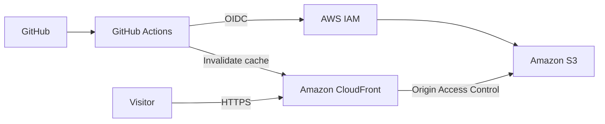

# Discreta - Production Landing Page

**Discreta** is a personal safety system designed for professionals who work alone. A discreet physical device pairs with a mobile application to provide emergency contacts with the information they need when a situation requires immediate attention.

This repository contains the **production landing page** for Discreta.

🌐 **Live:** https://discreta.ca

## 🚀 What I Built

I designed and developed the website from the ground up using **Next.js and TypeScript**, then built the AWS infrastructure and deployment pipeline around it.

The website is a **static Next.js export**, which allows it to be hosted on Amazon S3 while using CloudFront as the public-facing CDN.

The deployment is automated through **GitHub Actions** using AWS IAM and GitHub's OpenID Connect (OIDC) authentication. No long-lived AWS credentials are stored in GitHub.

### My work on the project

* Developed the website using **Next.js + TypeScript**
* Built a responsive landing page for the Discreta product
* Configured Next.js for static site generation
* Designed the AWS hosting architecture
* Provisioned infrastructure with **Terraform**
* Configured **Amazon S3** to host the static website
* Configured **Amazon CloudFront** as the CDN and public entry point
* Configured a **CloudFront Function** to handle clean URLs such as `/privacy`
* Built a **GitHub Actions CI/CD pipeline**
* Implemented GitHub to AWS authentication using **OIDC**
* Configured CloudFront cache invalidation after deployments
* Connected the production deployment to **discreta.ca**

## 🏗️ Architecture



### Why CloudFront?

Instead of serving the website directly from S3, CloudFront sits in front of the bucket and distributes cached content through AWS edge locations.

This provides:

* Lower latency for visitors
* Global content distribution
* HTTPS
* Caching of static assets
* Support for a custom domain
* A more secure architecture where the S3 bucket does not need to be publicly exposed

The architecture also uses **Origin Access Control (OAC)** so CloudFront can access the S3 bucket while direct public access to the bucket remains restricted.

## 🔐 CI/CD and AWS Security

The deployment pipeline uses **GitHub Actions + AWS IAM OIDC**.

Instead of storing an AWS access key and secret in GitHub, GitHub Actions requests a short-lived identity token and uses it to assume a dedicated IAM role.

```text
GitHub Actions
      │
      │ OIDC token
      ▼
AWS IAM
      │
      │ AssumeRoleWithWebIdentity
      ▼
Temporary AWS credentials
      │
      ├── S3 deployment
      │
      └── CloudFront invalidation
```

The deployment role follows the principle of **least privilege**, with permissions limited to the resources required to deploy the website and invalidate the CloudFront cache.

The infrastructure is defined as code using **Terraform**, making the AWS environment reproducible and version controlled.

## 🛠️ Tech Stack

### Frontend

* **Next.js**
* **React**
* **TypeScript**
* Static Site Generation
* Responsive design

### Cloud and Infrastructure

* **Amazon S3**
* **Amazon CloudFront**
* **AWS IAM**
* **AWS Certificate Manager**
* **Terraform**

### DevOps

* **GitHub Actions**
* GitHub OIDC
* Automated builds
* Automated S3 deployments
* CloudFront cache invalidation

## 📦 Local Development

Clone the repository:

```bash
git clone https://github.com/ItsmePatrice/panic-necklace.git
cd panic-necklace
```

Install dependencies:

```bash
npm ci
```

Start the development server:

```bash
npm run dev
```

The website will be available at:

```text
http://localhost:3000
```

## 🏭 Production Build

The website uses Next.js static export:

```ts
const nextConfig: NextConfig = {
  output: "export",
};
```

A production build can be generated with:

```bash
npm run build
```

This produces the static website in the `out/` directory.

The generated files are then synchronized with the production S3 bucket and CloudFront is invalidated so visitors receive the latest version.

## 🌎 Production

The website is currently hosted at:

**https://discreta.ca**

The production infrastructure is managed through Terraform and the website deployment is automated through GitHub Actions.

## 💡 About Discreta

The website is only one component of the larger Discreta project.

The underlying product combines:

**Physical device + Mobile application + Cloud backend**

The goal is to provide professionals working alone with a discreet way to trigger an emergency response while keeping trusted contacts informed of their location.

This project has given me hands-on experience across the entire software delivery lifecycle, from application development to cloud infrastructure, CI/CD, security, networking, and production deployment.
